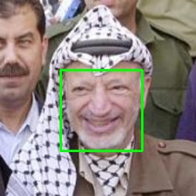

# Face Detector

Python package and Command Line Tool for state-of-the-art face detection and face
landmark points localization. It gathers the techniques implemented in dlib and
mtcnn, which can be easily switched between by setting a parameter in the
FaceDetector class instantiation (dlib\_5 is default if no technique is
specified, use dlib\_5 for dlib with 5 landmarks and dlib\_68 for dlib with 68
landmarks).

## How to Install:

    pip install face-detector

## How to Use python package:

    from face_detector import FaceDetector

    img_addr = "path/to/image.[jpg/png/jpeg ...]"

    # First parameter in FaceDetector constructor specifies face detection method (dlib: fl_5 or fl_68, mtcnn is default: mtcnn)
    face_detector = FaceDetector()
    faces = face_detector.get_faces(img_addr)

    # Or to get the most prominent face in photo
    main_face = face_detector.get_main_face(img_addr)

    # Show image with bounding boxes and landmarks
    import cv2
    img = cv2.imread(img_addr)

    for face in faces:
       bb = face.bounding_box
       landmarks = face.landmarks
       cv2.rectangle(img, (int(bb.x), int(bb.y)), (int(bb.x + bb.w), int(bb.y+bb.h)), (0, 255, 0), 1)
       for l in landmarks:
            cv2.circle(img, (l.x, l.y), 2, (0,0,255))

        cv2.imshow('img', img)
        cv2.waitKey(0)
        cv2.destroyAllWindows()

## How to use Command Line Tool

```console
    foo@bar:~$ facedetector /home/foo/images/Yasser_Arafat.jpg
```
The previous command will display the image passed in arguments with a bounding box wrapping every face in the image. Fig. 1 shows the image displayed.


*Fig. 1 Face detections as outputted by facedetector command line tool*


*Fig. 2 Main face in photo, outputted by facedetector using -j option*
<!-- -->

```console
    foo@bar:~$ facedetector /home/foo/images/Yasser_Arafat.jpg -j -o /tmp/output.jpg
```
The previous command adds -j and -o options, which capture the main
face in the photo and output the image with bounding boxes to the
specified path, respectivelly. It also display the image in Fig. 2.


<!--
[//]: <> - From Github:
[//]: <>    - Clone this repository
[//]: <>    - Install dependencies in requirements.txt:
[//]: <>        - pip install -r requirements.txt
[//]: <>    - You might need to install zlib and link it to /usr/lib/x86_64-linux-gnu/libz.so:
[//]: <>        ```console
[//]: <>         foo@bar:~/face_detector$ tar xzvf data/zlib-1.2.9.tar.gz
[//]: <>         foo@bar:~/face_detector$ cd data/zlib
[//]: <>         foo@bar:~/face_detector/data/zlib$ sudo ./configure && make && make install
[//]: <>         foo@bar:~/face_detector/data/zlib$ ln -s /lib/x86_64-linux-gnu/libz.so.1.2.8 /usr/lib/x86_64-linux-gnu/libz.so
[//]: <>        ```
-->
